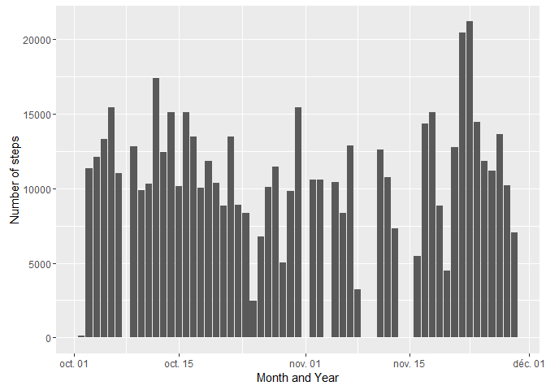
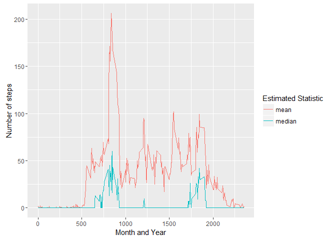
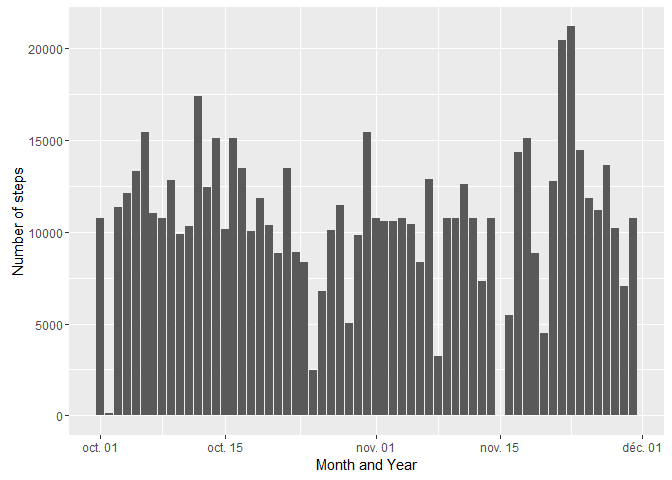
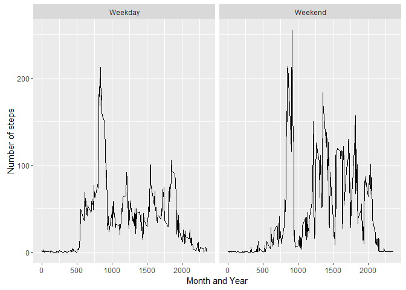

# Reproducible Research: Peer Assessment 1


## Loading and preprocessing the data

First part consists in collecting the data on the webstie provided on Coursera.


```r
library(ggplot2)
if (!file.exists("activity.csv")) {
        temp <- tempfile()
        download.file("https://d396qusza40orc.cloudfront.net/repdata%2Fdata%2Factivity.zip",temp)
        data <- read.csv(unz(temp, "activity.csv"))
        write.csv(data,"activity.csv",row.names=FALSE)
        unlink(temp)
} else {
        data <- read.csv("activity.csv")      
}
```

I then reprocess the data by getting rid of NA values and converting data observations into date class variable.


```r
data_copy <- data
data <- subset(data,!is.na(data$step))
data$date <- as.Date(data$date, format="%Y-%m-%d")
```


## What is mean total number of steps taken per day?

First we check that all intervall are available for the processed dates.
Then we conduct the analysis using the ggplot2 package.


```r
check <- aggregate(data$steps, by=list(data$date), FUN=length)
names(check) <- c("Observation.Date","Nb.Of.Intervalls")
min(check$Nb.Of.Intervalls)
```

```
## [1] 288
```

```r
freqs <- aggregate(data$steps, by=list(data$date), FUN=sum)
names(freqs) <- c("Observation.Date","Nb.Of.Steps")
(ggplot(freqs,aes(x=Observation.Date,y=Nb.Of.Steps))
+geom_bar(stat="identity")
+ylab("Number of steps")
+xlab("Month and Year")
)
```



We also report the mean and median of the total number of steps taken per day


```r
mn <- mean(freqs$Nb.Of.Steps)
mn
```

```
## [1] 10766.19
```

```r
md <- median(freqs$Nb.Of.Steps)
md
```

```
## [1] 10765
```

Mean is : 1.0766189\times 10^{4}
Median is : 10765


## What is the average daily activity pattern?

I now compute the time series plot of the average number of steps taken.

```r
mean.step <- aggregate(data$steps, by=list(data$interval), FUN=mean)
names(mean.step) <- c("Observation.Interval","Computed.Observation")

median.step <- aggregate(data$steps, by=list(data$interval), FUN=median)
names(median.step) <- c("Observation.Interval","Computed.Observation")

mean.median.step <- rbind(mean.step,median.step)
calculated <- factor(rep(c("mean","median"),each=length(mean.step$Computed.Observation)))
mean.median.step <- cbind(mean.median.step,Reference=calculated)

(ggplot(mean.median.step,aes(x=Observation.Interval,y=Computed.Observation))
+geom_line(aes(colour=Reference))
+ylab("Number of steps")
+xlab("Month and Year")
+scale_colour_discrete("Estimated Statistic")
)
```



And I calculate the 5-minute interval that, on average, contains the maximum number of steps.


```r
mean.step.by.interval <- aggregate(data$steps, by=list(data$interval), FUN=mean)
names(mean.step.by.interval) <- c("Observation.Interval","Mean.Nb.Of.Steps")
mean.step.by.interval$Observation.Interval[which.min(mean.step.by.interval$Mean.Nb.Of.Steps)]
```

```
## [1] 40
```


## Imputing missing values

My strategy is to replace NA value by the estimated mean per interval.


```r
data_missing <- subset(data_copy,is.na(data_copy$step))
dim(data_missing)[1]
```

```
## [1] 2304
```

```r
replace <- function (interval) {
        pos <- mean.step.by.interval$Observation.Interval==interval
        return(mean.step.by.interval$Mean.Nb.Of.Steps[pos])
}
data_NAimputed <- data_missing
data_NAimputed$steps <- sapply(data_missing$interval,FUN=replace)
```

I can now  plot the histogram of the total number of steps taken each day after missing values are imputed.


```r
data_reprocessed <- rbind(data,data_NAimputed) 
freqs2 <- aggregate(data_reprocessed$steps, by=list(data_reprocessed$date), FUN=sum)
names(freqs2) <- c("Observation.Date","Nb.Of.Steps")
(ggplot(freqs2,aes(x=Observation.Date,y=Nb.Of.Steps))
+geom_bar(stat="identity")
+ylab("Number of steps")
+xlab("Month and Year")
)
```



The mean does not change but there is a slight change in the median which is caused by our trivial method to replace NAs.


```r
mean(freqs2[,2])-mean(freqs[,2])
```

```
## [1] 0
```

```r
median(freqs2[,2])-median(freqs[,2])
```

```
## [1] 1.188679
```


## Are there differences in activity patterns between weekdays and weekends?

I can now build a panel plot comparing the average number of steps taken per 5-minute interval across weekdays and weekends


```r
classify <- function (date) {
        weekday <- as.POSIXlt(date)$wday
        if(weekday<6) {return("Weekday")
        }else{
                return("Weekend")
        }
}
data_completed <- data_reprocessed
weekday <- sapply(data_completed$date,FUN=classify)
data_completed <- data.frame(data_completed,weekday=weekday)
data_completed <- aggregate(data_completed$steps, by=list(data_completed$interval,data_completed$weekday), FUN=mean)
names(data_completed) <- c("Observation.Interval","Weekday","Mean.Nb.Of.Step")
```

And I report this into a plot.


```r
(ggplot(data_completed,aes(x=Observation.Interval,y=Mean.Nb.Of.Step))
+geom_line()
+ylab("Number of steps")
+xlab("Month and Year")
+ facet_grid(~Weekday)
)
```


